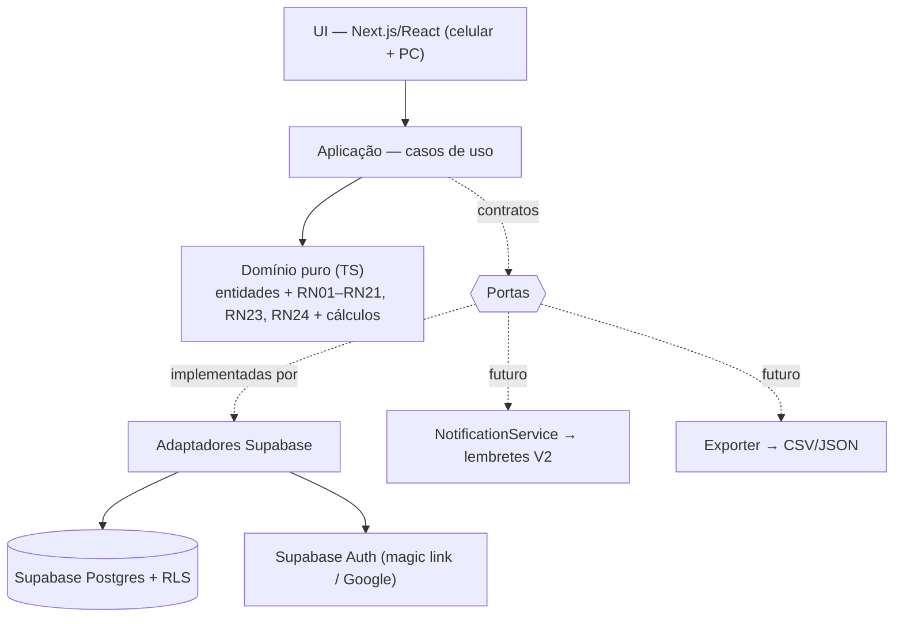
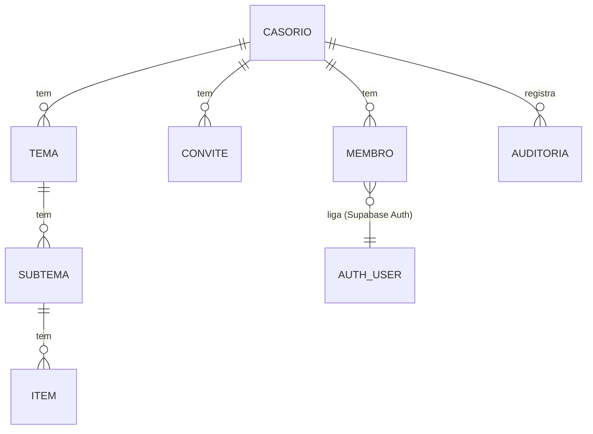

# PRD — Nosso Casório 💍
**Documento mestre · fonte da verdade do projeto**

- **Versão:** v1.1
- **Natureza:** só design e documentação. **Nenhuma linha de código nesta fase** — o código será escrito depois, em outro ambiente, a partir deste PRD.
- **Idioma / moeda:** PT-BR · Real (R$)

> **Regra do documento:** enxuto e vivo. Sem histórico de mudanças aqui (isso é papel do git). Regras de negócio numeradas (RN01…), decisões numeradas (D01…). Uma decisão pode tocar várias seções — quando mudar, atualizar **todas** as afetadas e revisar consistência.

---

## Progresso (12 passos)
- [x] **1. Refinar a ideia**
- [x] **2. Requisitos** (funcionais + não-funcionais)
- [x] **3. Regras de negócio** (RN01…)
- [x] **4. Arquitetura** (estilo, camadas, contratos, diagramas)
- [x] **5. Modelo de dados** (ER + decisões de schema)
- [x] **6. Componentes críticos** (o "coração" primeiro)
- [x] **7. Casos de uso** (fluxo fim-a-fim)
- [x] **8. Estratégia de testes**
- [x] **9. Segurança + qualidade**
- [x] **10. Legal / privacidade (LGPD)**
- [x] **11. Roadmap por versões** (V1 = fatia vertical)
- [x] **12. Entregáveis** (README + arquivo de contexto do agente)

---

## Dimensionamento (o tamanho do projeto — orienta todas as escolhas)

| Dimensão | Decisão |
|---|---|
| **Escopo** | Um **único** casamento. Não é produto/SaaS. A porta pra virar produto fica *guardada* (barata de abrir), mas **não** é construída no V1. |
| **Usuários** | O **casal** (donos, editam tudo) + **convidados de confiança** (colaboradores com acesso por papel). Convidados da *festa* **não** usam o app. |
| **Controle de acesso** | Mora na **camada mais baixa** (banco de dados), não só escondendo botão na tela. |
| **Execução** | **Nuvem**, web **responsivo** (celular + PC), no ar 24/7 sem depender do PC de casa. |
| **Infra** | **Free-tier** (custo zero), respeitando os limites de cada plano grátis. |
| **O que o produto é** | Checklist hierárquico **+ controle de orçamento + datas-alvo** (sem alertas automáticos no V1). |

---

## 1. Refinar a ideia

### 1.1 Visão
> Um web app **privado do casal** para organizar todas as decisões do casamento numa árvore **Tema → Subtema → Item**, enxergando num relance **o que já resolveu, o que falta, quanto custa e o que está perto do prazo** — planejando a dois (e com convidados de confiança), de qualquer lugar, no celular ou no PC.

### 1.2 Objetivos (V1)
1. **Centralizar** as decisões numa estrutura hierárquica navegável (Tema → Subtema → Item).
2. **Acompanhar status** de cada item num fluxo simples (*a decidir → decidido → contratado → pago*).
3. **Controlar o dinheiro:** custo estimado × real por item, total comprometido, total pago e **saldo contra o orçamento**.
4. **Não perder prazo:** data-alvo por item, com o painel **destacando atrasados e próximos do vencimento**.
5. **Planejar junto:** casal edita tudo; convidados de confiança com acesso **limitado por papel**.
6. **Acesso de qualquer lugar** (responsivo), no ar 24/7.

### 1.3 Fora do escopo (V1)
O que a gente **não** faz agora (evita super-construir):
- ❌ **Lembretes automáticos** (e-mail/push) — no V1 só há destaque visual; alertas ficam pra V2.
- ❌ **Virar produto pra outros casais** (SaaS) — porta guardada, mas não construída.
- ❌ **Lista de convidados da festa / RSVP / mesas** — é outro app. Não confundir com os "convidados de confiança", que são *colaboradores* do planejamento.
- ❌ **Lista de presentes** e integração com lojas.
- ❌ **Gestão de fornecedores / contratos / anexos de documentos.**
- ❌ **App nativo** (iOS/Android) — web responsivo resolve.
- ❌ **Multi-moeda / multi-idioma** — PT-BR e Real (R$) fixos.

### 1.4 Público-alvo
- **Primário — o casal:** os dois noivos. Donos, editam tudo.
- **Secundário — convidados de confiança:** pais, madrinha/padrinho, cerimonialista. Acesso **limitado por papel** (ex.: **Leitor** só vê; **Editor** edita o conteúdo). *Acesso por-tema fica pra V2 (D04).*
- **Não-usuário:** os convidados da festa **não** entram no app.

### 1.5 Glossário (base da consistência)

| Termo | Significado |
|---|---|
| **Casório (Espaço)** | O container de tudo. No V1 existe **um** só. |
| **Tema** | Categoria de topo (Comida, Noivo, Noiva, Cerimônia, Local…). |
| **Subtema** | Divisão de um tema (Comida → Bebidas, Sobremesa…). |
| **Item** | Unidade de decisão/checklist (Bebidas → Refrigerante). Carrega status, custo e data-alvo. |
| **Status** | Estado do item no fluxo: *a decidir → decidido → contratado → pago* (ou *a fazer → feito*, sem custo). Pode ainda ser **descartado**. |
| **Descartado** | Item considerado mas cortado ("não vai ter"). Fica registrado, porém **fora de todas as contas**; reativável. |
| **Custo estimado / real** | Valor previsto × efetivamente combinado. |
| **Orçamento** | Teto total planejado pro casamento; base do saldo. |
| **Comprometido** | Soma do custo efetivo (real quando houver, senão estimado) dos itens em **contratado ou pago** (RN14). |
| **Data-alvo** | Prazo até quando o item deve estar resolvido. |
| **Papel** | Nível de acesso de um usuário (Dono / Editor / Leitor — detalhado adiante). |

### 1.6 Métrica de sucesso (como saber que funcionou)
- 🎯 **A grande:** chegar no dia do casamento com **100% dos itens essenciais resolvidos** e **zero surpresa por esquecimento**.
- 💰 **Financeira:** fechar **dentro do orçamento** (saldo ≥ 0), com o comprometido visível a qualquer hora.
- 📱 **Adoção (o teste honesto):** o casal usa o app como **fonte única** e **abandona a planilha/WhatsApp**. Se em 2 semanas voltarem pra planilha, o app falhou.
- ⏰ **Prazo:** nenhum item essencial vence a data-alvo sem antes aparecer no painel de atrasados.

---

## 2. Requisitos

### 2.1 Papéis de acesso (ref. D04)
- **Dono** — o casal. Faz tudo, incluindo **convidar pessoas** e definir papéis.
- **Editor** — cria e edita qualquer tema/subtema/item; **não** gerencia pessoas.
- **Leitor** — só visualiza.

> Papel **global** (vale pro casório inteiro) no V1. Gancho barato pra evoluir p/ acesso por-tema depois.

### 2.2 Requisitos Funcionais (o que o sistema **faz**)
| # | Requisito | Nasce do objetivo |
|---|---|---|
| **RF01** | Login seguro por e-mail | Planejar junto |
| **RF02** | O Dono **convida** convidados de confiança (por e-mail) e define o papel (Editor/Leitor) | Planejar junto |
| **RF03** | Cada usuário só faz o que o **papel** permite — garantido na **camada de dados** | Segurança |
| **RF04** | **Temas:** criar, renomear, reordenar, remover | Centralizar |
| **RF05** | **Subtemas:** idem, dentro de um tema | Centralizar |
| **RF06** | **Itens:** título, *tem custo?*, custo estimado, custo real, data-alvo, observação, **essencial**, **responsável**, **fornecedor** (nome/telefone/link) | Centralizar / dinheiro / prazo |
| **RF07** | **Status** (com custo: *a decidir→decidido→contratado→pago*; sem custo: *a fazer→feito*) + **descartar / reativar** item — ref. D02, D13 | Acompanhar status |
| **RF08** | **Navegar a árvore** Tema→Subtema→Item, com progresso em cada nível | Centralizar |
| **RF09** | **Painel de orçamento:** orçado, comprometido, pago, **saldo** + alerta se estourar | Dinheiro |
| **RF10** | **Painel de prazos:** itens atrasados e a vencer em destaque | Prazo |
| **RF11** | **Progresso:** % de itens resolvidos (geral e por tema); destaca **essenciais pendentes** | Métrica de sucesso |
| **RF12** | **Template inicial:** casório nasce com temas/subtemas sugeridos, editáveis | Adoção |
| **RF13** | **Filtros:** por status, por tema, **por responsável**, "só atrasados", "só pendentes", **"só essenciais"** | Usabilidade |
| **RF14** | **Registro de atividade:** trilha cronológica de quem fez o quê e quando, filtrável | Planejar junto / confiança |
| **RF15** | **Contagem regressiva:** a tela inicial mostra quantos dias faltam pro casamento | Motivação |

> **Auditoria (D07):** cada registro guarda *inline* quem criou/alterou por último; além disso, uma **trilha completa e imutável** (tabela `auditoria`) grava toda gravação — visível na tela de atividade (RF14).

### 2.3 Requisitos Não-Funcionais (como o sistema **se comporta**)
| # | Requisito |
|---|---|
| **RNF01** | **Segurança:** auth obrigatória; controle de acesso na **camada de dados**; segredos fora do código/git |
| **RNF02** | **Privacidade (LGPD):** coletar o mínimo (nome/e-mail dos colaboradores); detalhado no passo 10 |
| **RNF03** | **Responsivo, mobile-first:** funciona bem no celular (uso na rua) e no PC |
| **RNF04** | **Desempenho:** ações comuns respondem em ~1s em condição normal |
| **RNF05** | **Disponibilidade:** 24/7 *best-effort* — free-tier pode ter *cold start* e limites |
| **RNF06** | **Durabilidade:** não perder dados; contar com backup do provedor gerenciado |
| **RNF07** | **Portabilidade:** persistência atrás de **contrato** (nuvem hoje, local amanhã) + **gancho `Exporter` pronto** no V1 (exportação CSV/JSON **entregue na V2**) |
| **RNF08** | **Usabilidade:** adicionar/editar item em poucos toques; curva ~zero pra noiva |
| **RNF09** | **Custo:** operar em **free-tier** |
| **RNF10** | **Localização:** PT-BR, R$, datas dd/mm/aaaa |
| **RNF11** | **Qualidade:** núcleo isolado por contratos; *quality gate* no CI (passo 9) |

### 2.4 Fora do V1 (registrado pra não esquecer)
Busca por texto (V2) · lembretes automáticos (V2) · acesso por-tema (evolução do D04). *Login: magic link + Google já no V1 (decidido no passo 4).*

---

## 3. Regras de negócio

**Hierarquia & integridade**
- **RN01** — 3 níveis: todo Subtema pertence a 1 Tema; todo Item a 1 Subtema (ref. D01).
- **RN02** — Nome de Tema/Subtema/Item é obrigatório (não vazio).
- **RN03** — Excluir Tema/Subtema com filhos apaga os filhos junto (**cascata**), com **confirmação explícita**.
- **RN04** — A ordem de temas/subtemas/itens é definida pelo usuário.

**Status** (ref. D02)
- **RN05** — Item *sem custo* → *a fazer → feito*. Item *com custo* → *a decidir → decidido → contratado → pago*. Qualquer item pode ainda ser **descartado** (ver RN23).
- **RN06** — Marcar *contratado* ou *pago* exige **custo real** preenchido (> 0).
- **RN07** — Avançar/voltar status é livre (sem sequência travada), respeitando a RN06.
- **RN08** — Item é **"resolvido"** quando *pago* (com custo) ou *feito* (sem custo). É o que conta no progresso (RF11) e o tira de pendentes/atrasados. Itens **descartados** ficam de fora da conta (ver RN23).
- **RN23** — **Descartar** ("não vai ter") pode ser feito de qualquer status e aceita um **motivo** opcional. Um item descartado sai de **todas as contas e painéis** (orçamento, progresso, prazos), mas **continua registrado** (visível como descartado) e pode ser **reativado**, voltando ao início do seu fluxo.
- **RN24** — Um item pode ser marcado **essencial**. Essenciais **pendentes** ganham destaque no progresso e nos painéis — é a base da métrica *"100% dos essenciais resolvidos"*.

**Dinheiro**
- **RN09** — O casório tem **um Orçamento total** (≥ 0), definido pelo Dono.
- **RN10** — Custos (estimado e real) são ≥ 0, em R$.
- **RN11** — **Custo efetivo** do item = custo real se houver, senão o estimado.
- **RN12** — **Estimado total** = soma do custo efetivo de *todos os itens com custo* **não descartados** (qualquer status ativo).
- **RN13** — **Pago** = soma do custo real dos itens em *pago*.
- **RN14** — **Comprometido** = soma do custo efetivo dos itens em *contratado* ou *pago*.
- **RN15** — **Saldo** = Orçamento − **Estimado total**. **Alerta de estouro** quando Estimado total > Orçamento (ref. D05).

**Prazo**
- **RN16** — Item **atrasado**: tem data-alvo, ela já passou, e o item não está resolvido.
- **RN17** — Item **a vencer**: data-alvo nos próximos **7 dias** e não resolvido.

**Acesso** (ref. D04)
- **RN18** — Só o **Dono** convida/remove pessoas e muda papéis.
- **RN19** — Sempre existe **≥ 1 Dono** (não dá pra remover/rebaixar o último) — **garantido no banco por trigger** (§9.1), não só no app.
- **RN20** — **Editor** edita conteúdo; **Leitor** só vê; ambos enxergam todo o casório.
- **RN21** — Todo controle de acesso é **garantido no banco**, não só na tela (ref. RNF01).
- **RN25** — Convite tem prazo (`expires_at`). Convite com prazo vencido é **inválido**: não pode ser aceito e conta como **não-pendente** (status `expirado`). Só o **Dono** revoga (`revogado`) ou reenvia (novo `token`/`expires_at`).

**Auditoria** (ref. D07)
- **RN22** — A trilha de auditoria é **imutável (append-only)**: ninguém (nem o Dono) edita ou apaga registros; a captura é **automática** a cada escrita, garantida no banco.

> **Painel financeiro (RF09)** mostra 4 números: **Estimado total** (base do alerta) · **Comprometido** · **Pago** · **Saldo**.

---

## 4. Arquitetura

### 4.1 Estilo
**Monólito modular** com **arquitetura hexagonal (Ports & Adapters)**. O núcleo de domínio não conhece banco, tela nem framework — só regras. Tudo externo entra por **contrato**.

### 4.2 Stack (ref. D06) — tudo free-tier
| Camada | Tecnologia |
|---|---|
| UI + aplicação | **Next.js (React + TypeScript)** — App Router |
| Banco + Auth | **Supabase** — Postgres + Auth + **RLS** |
| Deploy | **Vercel** (app) + **Supabase** (banco) |
| CI | **GitHub Actions** |
| Qualidade | **SonarCloud** (quality gate no CI) |

> **Honestidade sobre free-tier:** Vercel *Hobby* é para uso **não comercial** (ok pra um app pessoal). Supabase free **pausa** o projeto após ~1 semana de inatividade — improvável durante o planejamento (uso frequente), mas fica o registro. Detalhes no passo 9/11.

### 4.3 Camadas
1. **UI (web responsiva)** — árvore, painéis, formulários. Fala só com a Aplicação.
2. **Aplicação (casos de uso)** — orquestra e aplica as RNs.
3. **Domínio (núcleo puro TS)** — entidades + **RN01–RN21, RN23, RN24** + cálculos financeiros/prazo. **Zero dependência externa.** *(A RN22/auditoria é garantida no banco por trigger — ver C4 e §9.)*
4. **Portas (contratos)** — `CasorioRepository`, `AuthService`, `AccessPolicy`; ganchos `NotificationService`, `Exporter`.
5. **Adaptadores (Supabase)** — implementam as portas. O **RLS do Postgres reforça o acesso** (RN21 na camada mais baixa).

### 4.4 Decisões de arquitetura
- **Cálculos no domínio (TS)**, não em views SQL — mantém o núcleo isolado e testável (views ficam como otimização futura).
- **O servidor fala com o Supabase usando o token do usuário**, pra o **RLS ser a garantia real** — a *service key* nunca entra no caminho comum (senão o acesso deixaria de morar no banco).
- **Sem tempo-real no V1** — *Supabase Realtime* como gancho.

### 4.5 Estrutura de pastas sugerida
```
/src
  /domain        # entidades + regras (RN) + cálculos — puro, sem infra
  /application   # casos de uso (addItem, changeStatus, getDashboard, invitePerson…)
  /ports         # interfaces (CasorioRepository, AuthService, AccessPolicy…)
  /adapters
    /supabase    # implementações das portas
  /app           # Next.js App Router (páginas + server actions/route handlers)
  /components    # UI React
/supabase
  /migrations    # schema SQL + policies RLS
```

### 4.6 Diagrama (Mermaid)


---

## 5. Modelo de dados

### 5.1 Diagrama ER (Mermaid)


### 5.2 Tabelas e campos

**casorio** — o Espaço (1 no V1)
`id` · `nome` · `data_casamento` · `orcamento_total` (RN09) · `created_at/updated_at`

**membro** — usuário ↔ casório + papel *(base do RLS)*
`id` · `casorio_id→casorio` · `user_id→auth.users` · `papel` {dono·editor·leitor} · `unique(casorio_id, user_id)` · (D04, RN18–20)

**convite** — RF02
`id` · `casorio_id` · `email` · `papel` {editor·leitor} · `status` {pendente·aceito·revogado·**expirado**} · `token` · `expires_at` · (RN25)

**tema**
`id` · `casorio_id` · `nome` (RN02) · `ordem` (RN04) · *auditoria inline*

**subtema**
`id` · `tema_id→tema` · `casorio_id` · `nome` · `ordem` · *auditoria inline*

**item**
`id` · `subtema_id→subtema` · `casorio_id` · `titulo` · `tem_custo` (D02) · `status` {a_fazer·feito·a_decidir·decidido·contratado·pago·**descartado**} (RN05, RN23) · `custo_estimado` (≥0) · `custo_real` (≥0) · `data_alvo` · `observacao` · `motivo_descarte` (null) · **`essencial`** (bool, RN24) · **`responsavel_membro_id`→membro** (null) · **`fornecedor_nome`** (null) · **`fornecedor_contato`** (null) · **`fornecedor_link`** (null) · `ordem` · *auditoria inline*

**auditoria** — trilha de "quem gravou o quê" *(append-only — ref. D07 / RN22 / RF14)*
`id` · `casorio_id` · `ator_user_id→auth.users` · `ator_nome` (snapshot) · `acao` {criou·editou·excluiu·mudou_status·…} · `entidade` {casorio·tema·subtema·item·membro·convite} · `entidade_id` · `entidade_rotulo` (snapshot p/ leitura) · `detalhe` (jsonb, ex.: `{"de":"a_decidir","para":"pago"}`) · `criado_em`

> *auditoria inline = `created_at`, `updated_at`, `created_by`, `updated_by` — mostram rápido o estado atual ("última alteração por X"). A tabela **auditoria** guarda o histórico completo e imutável.*

### 5.3 Decisões de schema
- **D01 resolvido → 3 tabelas separadas** (tema/subtema/item), não árvore auto-referente. Legível; FKs e RLS simples; 3 níveis cobrem casamento. Crescer = migração localizada (YAGNI).
- **`casorio_id` desnormalizado** em subtema, item e auditoria → policies RLS **triviais e rápidas** ("o casório é meu?"), sem joins recursivos. Consistência por trigger/app.
- **`ON DELETE CASCADE`** nas FKs → realiza a **RN03** no banco (a confirmação é na UI).
- **Auditoria automática por trigger** (AFTER INSERT/UPDATE/DELETE nas tabelas de negócio) → captura à prova de esquecimento, na camada mais baixa. Campo **`detalhe` em `jsonb`** guarda o contexto: hoje o resumo da ação; se um dia quiser "antes → depois" campo a campo, **não muda o schema**.
- **Auditoria imutável** (RN22): só INSERT (por trigger) e SELECT (membros); sem UPDATE/DELETE pra ninguém.
- **Status como enum único** (7 valores, incluindo *descartado*); coerência com `tem_custo` (RN05) via domínio + `CHECK`.
- **Multi-casório de graça:** tudo tem `casorio_id` → o schema já suporta virar produto. Porta barata, sem construir nada a mais hoje.

---

## 6. Componentes críticos

> O **"coração" primeiro**: as partes que mais **importam** e mais **erram**. Todas vivem no **domínio puro** (testáveis sem banco). O foco é **onde costuma dar errado**.

### C1 — Motor Financeiro *(o mais crítico)*
- **Faz:** calcula **Estimado total · Comprometido · Pago · Saldo · alerta de estouro** (RN11–RN15).
- **Recebe → devolve:** (itens + orçamento) → `{ estimadoTotal, comprometido, pago, saldo, estourou }`.
- **Onde erra:**
  - Dinheiro nunca em `float` → **centavos (inteiro)**; sem erro de arredondamento (ref. D08).
  - Item *com custo* sem preço → efetivo = 0 **+ flag "sem preço"** (não somar em silêncio).
  - Trocar por engano os status que contam em Comprometido/Pago (RN13/RN14).
  - **Esquecer de excluir os descartados** de todas as somas (RN12/RN23).
- **Invariante (vira teste):** `pago ≤ comprometido ≤ estimadoTotal`; `saldo = orçamento − estimadoTotal`.

### C2 — Máquina de Status do Item
- **Faz:** valida/efetua transições conforme `tem_custo` (RN05), exige custo real p/ *contratado/pago* (RN06), permite avançar/voltar (RN07), **descartar/reativar** (RN23), define **"resolvido"** (RN08).
- **Onde erra:**
  - Status **inválido pro tipo** (ex.: *feito* num item com custo) → rejeitar.
  - *Contratado/pago* **sem valor** → bloquear (RN06).
  - Virar `tem_custo` sim→não com status avançado → **regra de conversão:** *pago/contratado* → *feito*; demais → *a fazer*; custos preservados, só ocultos.

### C3 — Motor de Prazos
- **Faz:** classifica item em **atrasado / a vencer / ok** (RN16–RN17); calcula a **contagem regressiva** até a data do casamento (RF15).
- **Onde erra:**
  - **Timezone** → **`America/Sao_Paulo`**, comparação por **data** (não hora), com o **"hoje" injetado** (o núcleo não lê o relógio → testável) (ref. D08).
  - Item **resolvido** nunca é atrasado/a-vencer; **sem data-alvo** também não.

### C4 — Guardião de Acesso + Auditoria
- **Faz:** papéis definem o permitido (RN18–RN21); **RLS no banco é a garantia**; **triggers** gravam a auditoria (RN22).
- **Onde erra:** confiar só na UI (esquecer o RLS); trigger não capturar o **ator** (`auth.uid()` nulo em contexto de serviço).
- *Detalhe das policies SQL → **passo 9 (Segurança)**; aqui fica o contrato.*

---

## 7. Casos de uso

### 7.1 A fatia vertical do V1 *(o caminho que prova tudo)*
> **Entrar → ver a árvore → mexer num item → ver o painel e a trilha reagirem.**

1. **Login** (magic link / Google).
2. **Onboarding (1ª vez):** cria o casório (nome, data, orçamento), vira **Dono**, e o **template** de temas é semeado (RF12 · D09).
3. **Navegar** a árvore Tema→Subtema→Item (RF08).
4. **Agir:** editar um item — `tem_custo`, custo estimado, data-alvo; **avançar status até *pago*** informando o custo real (C2).
5. **Ver reagir:** painel financeiro (saldo/estouro), progresso e prazos atualizam (C1/C3); a **trilha registra** "Fulano marcou X como pago" (auditoria).

Esse caminho toca **UI → aplicação → domínio → Supabase (RLS + trigger)** — construído **primeiro** (ref. roadmap, passo 11).

### 7.2 Fluxo principal — "marcar item como pago" (Mermaid)
```mermaid
sequenceDiagram
    actor U as Usuário (Dono/Editor)
    participant UI as UI (Next.js)
    participant APP as Caso de uso: mudarStatus
    participant DOM as Domínio (C2 + C1)
    participant SB as Supabase (RLS + trigger)
    U->>UI: marca item como "pago" (+ custo real)
    UI->>APP: mudarStatus(itemId, "pago", custoReal)
    APP->>DOM: valida transição (RN05/06/07)
    DOM-->>APP: ok ou erro de regra
    APP->>SB: update item (com token do usuário)
    SB->>SB: RLS confere acesso · trigger grava auditoria
    SB-->>APP: ok
    APP->>DOM: recalcula painel (C1)
    APP-->>UI: item + painel atualizados
    UI-->>U: saldo/progresso mudam; atividade registrada
```

### 7.3 Catálogo de casos de uso
| UC | Caso de uso | Usa | RF |
|---|---|---|---|
| **UC01** | Autenticar (login/logout) | AuthService | RF01 |
| **UC02** | Onboarding: criar casório + semear template + virar Dono | Repo | RF12 |
| **UC03** | Convidar colaborador / aceitar convite | Repo, AccessPolicy | RF02 |
| **UC04** | CRUD de tema/subtema/item | Repo, C2 | RF04–06 |
| **UC05** | Editar item (custo, data, observação) | Repo | RF06 |
| **UC06** | Mudar status do item | **C2** | RF07 |
| **UC07** | Ver painéis (financeiro, prazos, progresso) | **C1, C3** | RF09–11 |
| **UC08** | Navegar/filtrar a árvore | Repo | RF08, RF13 |
| **UC09** | Definir/ajustar orçamento | Repo | RF09 |
| **UC10** | Ver registro de atividade | Repo | RF14 |

---

## 8. Estratégia de testes

### 8.1 A pirâmide
| Nível | Quanto | O quê | Ferramenta |
|---|---|---|---|
| **Base — Unitário** | muitos | Domínio puro: **C1/C2/C3 + RNs**. Funções puras, rápidas. | **Vitest** |
| **Meio — Componente/Integração** | alguns | Componentes React (painel, form); casos de uso com **repo fake**; **policies RLS** no Postgres | **React Testing Library** + Supabase local |
| **Topo — E2E** | poucos | A **fatia vertical** (7.1) e o fluxo de convite/permissão | **Playwright** |

### 8.2 O que não pode faltar
- **Coração coberto:** motor financeiro (invariantes, centavos, item sem preço), máquina de status (transições inválidas, RN06, conversão `tem_custo`), prazos (timezone, bordas de 7 dias, resolvido não atrasa).
- **Testes de RLS (segurança):** provar que **Leitor não edita**, que **membro de outro casório não vê nada**, que **auditoria não é editável** (RN21/RN22). Exige **Supabase local** (CLI).
- **E2E enxuto:** só fluxos críticos. E2E é lento — poucos e bons.

### 8.3 Apoio
- **"Hoje" e dinheiro injetáveis** → núcleo testa sem relógio/aleatoriedade (D08).
- **Repo fake em memória** → testar casos de uso sem banco.
- **Seed/fixtures reproduzíveis.**
- Meta: **alta cobertura no `/domain`**; não perseguir 100% na UI.

### 8.4 No CI (liga ao passo 9)
- **Todo push:** unit + componente (rápidos).
- **PR / nightly:** + RLS e E2E (mais lentos).

---

## 9. Segurança + qualidade

### 9.1 Segurança
**Segredos (nunca no código/git)**
- `.env.local` no `.gitignore`; variáveis no painel da **Vercel/Supabase**.
- Supabase **anon key** é pública (protegida por RLS). **`service_role` key** é secreta → **nunca no cliente**; evitar até no servidor (usar o token do usuário).

**Isolamento de dados — RLS (garantia na camada mais baixa)**
- **RLS habilitado em todas as tabelas.**
- Regra base: só acessa linhas de casórios onde é **membro** (`casorio_id ∈ meus casórios` via `auth.uid()`).
- **Editor** grava conteúdo · **Leitor** só lê · só **Dono** mexe em `membro`/`convite` (RN18–20).
- **Último Dono protegido (RN19):** trigger `BEFORE UPDATE/DELETE` em `membro` **bloqueia** remover ou rebaixar o último `dono` do casório — garantia na camada mais baixa, não só na UI/app.
- **auditoria:** SELECT p/ membros; **sem UPDATE/DELETE**; INSERT só via trigger `SECURITY DEFINER` (RN22).

**Defesa em profundidade**
- Todo dado externo é **hostil** → validação no servidor (**zod**) antes de gravar, **além** do RLS.
- 3 camadas: UI esconde → servidor valida → **RLS garante**.
- **Convite:** token aleatório, uso único, com expiração.
- HTTPS pela Vercel; sessão em cookies seguros.

### 9.2 Qualidade — quality gate no CI
- **GitHub Actions:** ESLint + Prettier + `tsc` (typecheck) + testes.
- **SonarCloud:** cobertura, *code smells*, vulnerabilidades, duplicação — **gate que barra o merge**.
- **Branch protection:** PR obrigatório + CI verde pra mergear na `main`.

### 9.3 Visibilidade do repositório (ref. D11)
- **Repositório público** → SonarCloud grátis + GitHub Actions com minutos **ilimitados**.
- Seguro porque **dados** ficam no Supabase (RLS) e **segredos** em variáveis de ambiente (fora do git) — o código não carrega nada sensível.

### 9.4 Versionamento do app (release automático — ref. D15)
> Versão **do site/app** (≠ versão deste PRD). Segue **Semantic Versioning** `MAJOR.MINOR.PATCH` e é **bumpada automaticamente pelo CI** a partir do tipo de mudança — o dev não escolhe o número na mão.

- **Fonte da decisão = mensagens de commit (Conventional Commits).** O CI lê os commits desde a última tag e decide o incremento:
  | Commit | Efeito na versão | Exemplo |
  |---|---|---|
  | `fix:` (correção) | **PATCH** | `1.1.2 → 1.1.3` |
  | `feat:` (nova função) | **MINOR** | `1.1.3 → 1.2.0` |
  | `feat!:` / rodapé `BREAKING CHANGE:` | **MAJOR** | `1.2.0 → 2.0.0` |
  | `chore:`/`docs:`/`test:`/`refactor:`… | **nenhum** (sem release) | — |
- **Ferramenta:** `semantic-release` no **GitHub Actions** (job na `main` após CI verde). Ele calcula a versão, **cria a tag git**, gera o `CHANGELOG.md` e dispara o deploy na Vercel. Zero bump manual.
- **Versão visível no app:** injetada em build-time (`NEXT_PUBLIC_APP_VERSION`) e exibida no **rodapé** — o casal vê qual versão está no ar.
- **Um `MAJOR.MINOR.PATCH` por merge na `main`.** O maior incremento entre os commits do lote vence (um `feat` + vários `fix` no mesmo merge = **MINOR**).
- **Antes do 1.0.0 público:** o app nasce em `0.1.0`; durante o V1 (M1–M4) `MINOR` acumula função e `1.0.0` marca "casal usando de verdade" (meta do V1).

---

## 10. Legal/ético + privacidade

### 10.1 Terceiros que consumo (ToS)
- **Supabase · Vercel · Google OAuth** — uso dentro dos termos (free-tier; **Vercel Hobby = não comercial**, ok pra app pessoal).
- O app é *self-contained*: **não** faz scraping nem consome API de terceiros de forma sensível → sem risco de ToS além de respeitar os planos grátis.

### 10.2 Dados pessoais & LGPD
- **Quais dados:** **nome + e-mail** dos usuários (casal + convidados), via Auth. Observações podem citar fornecedores. **Nada sensível.**
- **Minimização (RNF02):** só nome/e-mail necessários.
- **Finalidade:** exclusivamente organizar **este** casamento.
- **Não logar nem expor** dado pessoal.
- **Base legal:** consentimento (cadastro voluntário).
- **Direitos do titular:** o Dono remove um membro; qualquer titular pode pedir **exclusão** dos seus dados.
- **Retenção:** manter enquanto o casório existir; excluir depois.
- **Subprocessadores:** dados no Supabase/Vercel; **não vendemos nem compartilhamos**.
- **Honestidade:** rigor proporcional a app pessoal. **Virar produto** exigirá política de privacidade formal e aviso aos titulares — *porta registrada, não construída*.

### 10.3 Licenças (ref. D12)
- **Projeto sob licença MIT** — qualquer um pode usar/adaptar mantendo o crédito.
- **Dependências:** manter só permissivas (MIT/Apache/BSD); **evitar copyleft forte** (GPL).

---

## 11. Roadmap

### 🎯 V1 — o casal usando de verdade *(meta: abandonar a planilha)*
- **M1 — Esqueleto fim-a-fim** *(fatia vertical mais fina):* Auth + criar casório + 1 tema→subtema→item salvando no Supabase **com RLS**. Prova a arquitetura, mata o risco técnico.
- **M2 — Núcleo do produto** *(usável sozinho):* árvore completa (CRUD), item com status + custo (estimado/real) + data-alvo + observação + **essencial** + **responsável** + **fornecedor**, **painel financeiro** + **prazos** + **progresso** + **contagem regressiva**. Larga a planilha.
- **M3 — Colaboração:** papéis Dono/Editor/Leitor, convite por e-mail, **auditoria visível** (tela de atividade).
- **M4 — Acabamento:** template inicial, filtros, polish mobile, quality gate completo (Sonar).

### 🔜 V2 — depois do V1 no ar
Lembretes automáticos (porta `NotificationService`) · **exportar CSV/JSON** (porta `Exporter`) · busca por texto · **acesso por-tema** (evolui D04) · tempo-real (Supabase Realtime).

### 🚪 V3+ — portas já abertas (não construídas)
Produto **multi-casal** (schema já tem `casorio_id`) · lista de convidados da festa/RSVP · fornecedores/contratos.

> Cada item futuro cai numa **porta barata** já plantada (NotificationService, Exporter, `casorio_id`, AccessPolicy) — evolução, não reescrita.

---

## 12. Entregáveis

Docs de apoio (cada um com seu público) — o **PRD continua sendo a fonte da verdade**:
- **[README.md](../README.md)** — humanos: o que é, como rodar, estrutura. Aponta pro PRD, não o repete.
- **[AGENTS.md](../AGENTS.md)** — contexto pra IAs: regras de ouro, convenções cravadas, ordem de construção, ponteiros pro PRD.
- **[CLAUDE.md](../CLAUDE.md)** — redireciona pro AGENTS.md (pra usar Claude Code no outro PC).
- **[LICENSE](../LICENSE)** — texto MIT (D12).

---

## Registro de decisões
> Decisões já tomadas. As que serão detalhadas adiante apontam a seção de destino, pra não se perderem.

- **D01 — Profundidade da árvore** *(→ Seção 5):* 3 níveis fixos no V1 (Tema → Subtema → Item); modelar de forma barata pra permitir crescer depois, sem reescrita.
- **D02 — Itens com/sem custo** *(→ Seção 3):* todo item tem uma marca **"tem custo? sim/não"**. O fluxo *contratado/pago* só se aplica a itens **com** custo; itens **sem** custo usam um fluxo simples *a fazer → feito*.
- **D03 — Local do PRD:** este documento vive em `docs/PRD.md`. ✔
- **D04 — Papéis de acesso** *(→ Seção 2):* papéis **globais** no V1 — **Dono / Editor / Leitor**. Controle garantido na **camada de dados**. Gancho barato pra evoluir p/ acesso por-tema depois.
- **D05 — Base do controle financeiro** *(→ Seção 3, RN15):* Saldo e alerta de estouro usam o **Estimado total** (plano inteiro), não só o comprometido — avisa cedo, enquanto ainda dá pra cortar.
- **D06 — Stack** *(→ Seção 4):* **Next.js (React + TypeScript)** + **Supabase (Postgres + Auth + RLS)**, deploy **Vercel**, CI **GitHub Actions**, qualidade **SonarCloud**. Tudo free-tier. RLS = garantia de acesso no banco.
- **D07 — Auditoria** *(→ Seções 2/3/5):* trilha **imutável (append-only)** de quem-gravou-o-quê, capturada **automaticamente por trigger** no Postgres; detalhe em `jsonb` (resumo da ação no V1, porta barata pro "antes→depois"). Visível na tela de atividade (RF14).
- **D08 — Design do núcleo** *(→ Seção 6):* dinheiro em **centavos (inteiro)**; prazos em **`America/Sao_Paulo`** comparando por data; o núcleo recebe o **"hoje" injetado** (cálculos testáveis, sem relógio real).
- **D09 — Onboarding** *(→ Seção 7):* o 1º acesso cria o casório (nome, data, orçamento) e o usuário vira **Dono** (reforça RN19); o **template** de temas é semeado automaticamente, com opção de começar vazio.
- **D10 — Stack de testes** *(→ Seção 8):* Vitest + React Testing Library + Playwright; **Supabase local** (CLI) pros testes de RLS. Muitos unit no domínio, poucos E2E nos fluxos críticos.
- **D11 — Repositório público** *(→ Seção 9):* libera **SonarCloud grátis** e **Actions ilimitado**. Seguro: dados no Supabase (RLS) e segredos em env vars, nunca no git.
- **D12 — Licença MIT** *(→ Seção 10):* projeto público sob **MIT**; manter dependências permissivas (evitar GPL).
- **D13 — Estado "descartado"** *(→ Seções 1/2/3/5/6):* qualquer item pode ser **descartado** ("não vai ter"), com motivo opcional; fica registrado e **reativável**, mas **fora de todas as contas** (orçamento, progresso, prazos). Alternativa ao apagar, que é definitivo.
- **D14 — Melhorias do item (V1)** *(→ Seções 2/3/5/6):* item ganha **essencial** (destaca no progresso, RN24), **responsável** (um membro; habilita o filtro "meus itens"), **contato do fornecedor** (nome/telefone/link) e **contagem regressiva** pro casamento na tela inicial (RF15).
- **D15 — Versionamento automático do app** *(→ Seção 9.4):* app segue **SemVer** `MAJOR.MINOR.PATCH`, **bumpado automaticamente** pelo CI a partir de **Conventional Commits** (`fix`=PATCH, `feat`=MINOR, `BREAKING CHANGE`=MAJOR) via `semantic-release` no GitHub Actions — cria tag, `CHANGELOG.md` e deploy. Versão exibida no rodapé (`NEXT_PUBLIC_APP_VERSION`). Distinta da versão deste PRD.

---

*PRD **v1.1** completo (12/12). Próximo passo do projeto: criar o repositório e iniciar o **M1** (fatia vertical).*
